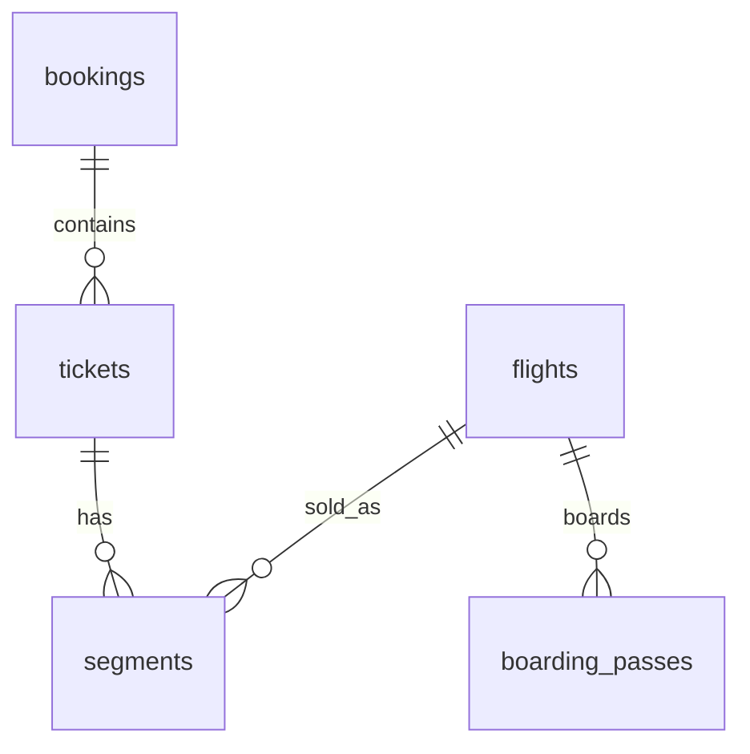

# Пример ожидаемых артефактов 5.3

Вариант: ticket/segment/flight fragment.

```text
semester-5/practice-05-03/
  README.md
  relationship_checks.sql
  er.md
  relationship_evidence.md
  answers.md
```

## `er.md`

Файл может выглядеть так:

```text
# ER fragment
```



Пояснение в том же `er.md`: `tickets` to `segments` is 1:N. Participation of `segments` in `tickets` is mandatory from the segment side because a segment references a ticket. Whether every ticket must have at least one segment is a domain rule checked by diagnostics, not necessarily by schema.

## `relationship_evidence.md`

```md
# Evidence

## segments_per_ticket

Rule: one ticket can contain several flight segments.
Result: sample contains tickets with 1, 2 and more segments.
Conclusion: ER cardinality `tickets 1:N segments` is plausible and consistent with data.

## tickets_without_segments

Rule: every issued ticket should have at least one segment.
Result: zero rows in my run.
Conclusion: no violations found in current data. This does not prove the DB schema guarantees the rule.

## boarding_pass_seat_not_in_airplane_configuration

Rule: boarding pass seat must exist in airplane configuration.
Result: zero rows.
Conclusion: current data is consistent with this rule.
```

## `answers.md`

```md
# Answers

The ER fragment includes bookings, tickets, segments, flights and boarding passes.
Cardinalities supported by schema: booking to tickets, ticket to segments, flight to segments.
Domain rules not fully guaranteed: passenger cannot have overlapping flights; seat should match airplane configuration; route validity should cover scheduled departure.
```
