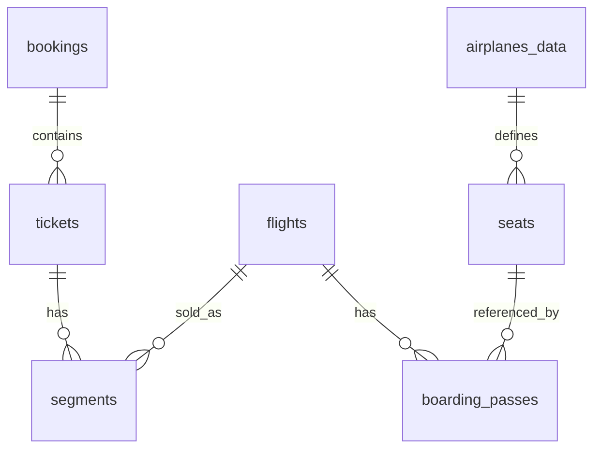

# Решение 5.3. Восстановление ER-фрагмента

## Пример ER-фрагмента

## Evidence

- `segments_per_ticket`: подтверждает, что билет может включать несколько сегментов. Это наблюдение на данных, а не само по себе ограничение.
- `tickets_without_segments`: если возвращает ноль строк, нарушений на текущих данных нет; схема может не гарантировать, что каждый билет всегда имеет сегмент.
- `boarding_pass_seat_not_in_airplane_configuration`: если ноль строк, посадочные талоны согласованы с конфигурацией мест на текущих данных.
- `duplicate_seat_on_flight`: если ноль строк, нет двух посадочных талонов на одно место одного рейса.
- `flights_per_route`: маршрут является шаблоном, по которому создается много рейсов.

## Правила, которые важно не переутверждать

- Пассажир не должен иметь пересекающиеся перелеты: обычно не гарантируется схемой.
- Маршрут должен быть действителен на момент вылета: проверяется через `route_no` и `validity`, но конкретная гарантия зависит от ограничения/представления.
- Место в посадочном талоне должно существовать в конфигурации самолета: может проверяться диагностикой, но не обязательно прямым FK.

## Приемлемые альтернативы

Можно рисовать только фрагмент варианта, а не всю демобазу. Главное: у каждой связи должны быть кардинальность, обязательность участия и evidence.
