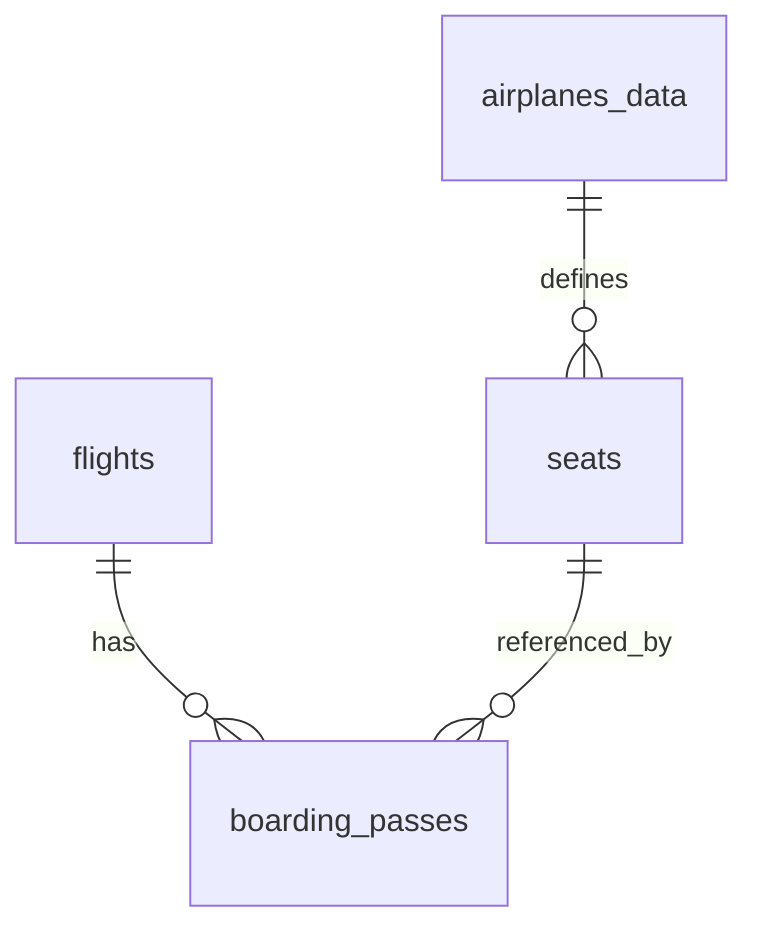

# Пример ожидаемых артефактов 5.4

Вариант: `boarding_flow`.

```text
semester-5/checkpoint-01-schema-analysis/
  README.md
  answers.md
  er.md
```

## `answers.md`

```md
# Checkpoint 01: boarding_flow

## Tables

`flights` is a concrete scheduled flight.
`boarding_passes` is a boarding document issued for a ticket segment on a flight.
`seats` describes seats available in an airplane configuration.
`airplanes_data` stores airplane type metadata.

## Keys and links

- `flights.flight_id` identifies a flight.
- `boarding_passes` is identified by the issued boarding pass key or by the domain pair `(ticket_no, flight_id)`.
- `boarding_passes.flight_id` references `flights`.
- Seat validity is checked through flight airplane configuration and `seats`.

## Business rules

Explicit or strongly supported:

- boarding pass belongs to an existing flight;
- one seat on one flight should not be issued twice;
- boarding pass seat should exist in airplane seat map.

Hypotheses:

- boarding sequence strictly follows check-in order;
- every sold segment eventually gets a boarding pass.

## Diagnostics

`duplicate_seat_on_flight = 0`: no duplicate seat assignment was found.
`boarding_pass_without_segment = 0`: no boarding pass without matching ticket segment was found.
`boarding_pass_seat_not_in_airplane = 0`: current data agrees with airplane seat configuration.
```

## `er.md`



В `er.md` рядом с диаграммой должен быть короткий текст:

```text
The flight side is mandatory for boarding passes.
Seat validity is inferred through airplane configuration.
The diagnostic output confirms no duplicate seats in current data.
```
