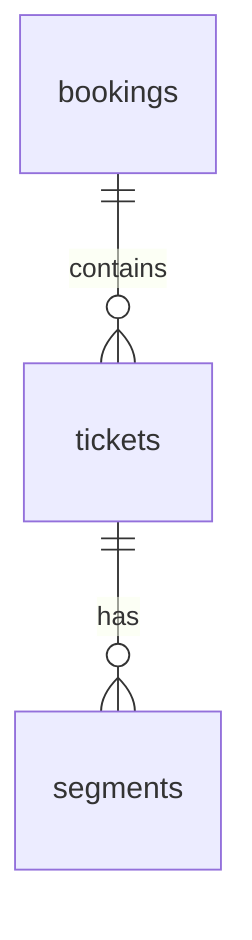

# Практика 5.4. Контрольная 1: анализ схемы и предметной области

Тип занятия: очная контрольная. Интерактивная лабораторная работа не проводится.

На этой контрольной вы не пишете SQL самостоятельно. Вы анализируете выданный фрагмент схемы Postgres Pro demo database, документацию к нему и готовые диагностические выводы.

## Формат

- Работа индивидуальная.
- Время: 70-80 минут.
- Разрешены материалы курса и официальная документация PostgreSQL/Postgres Pro demo database.
- Не разрешены LLM, форумы, чаты, мессенджеры и чужие решения.
- Сдача выполняется commit-ом до конца пары.

## Вариант

Преподаватель назначает один фрагмент:

- `ticket_flow`: `bookings`, `tickets`, `segments`, `flights`;
- `boarding_flow`: `flights`, `boarding_passes`, `seats`, `airplanes_data`;
- `route_flow`: `routes`, `airports_data`, `flights`, `segments`.

Для каждого фрагмента преподаватель выдает:

- перечень таблиц и ключевых столбцов;
- 2-3 готовых диагностических вывода из `provided/diagnostic_outputs.md` или аналогичного файла варианта;
- при необходимости небольшой фрагмент справочной документации.

## Что нужно сдать

Папка в репозитории:

```text
semester-5/checkpoint-01-schema-analysis/
  README.md
  answers.md
  er.md
```

`answers.md` должен содержать:

1. Назначение каждой таблицы фрагмента: не пересказ имени, а смысл в предметной области.
2. Первичные ключи, внешние ключи и потенциальные ключи.
3. Кардинальности связей: `1:1`, `1:N`, `M:N` через связующую таблицу, optional/mandatory-участие.
4. 3-5 явных бизнес-правил, которые видны из схемы.
5. 1-2 неявных или спорных правила, которые кажутся правдоподобными, но не доказаны одной схемой.
6. Интерпретацию каждого готового диагностического вывода: какое правило проверялось и что означает результат.
7. Короткий вывод: какие части фрагмента надежно зафиксированы схемой, а какие требуют проверки приложением или процессом.

`er.md` должен содержать ER-фрагмент в Mermaid или текстовую схему.

Пример Mermaid-формата:



## Запрещено

- Добавлять самостоятельно написанные SQL-запросы как основной ответ.
- Подменять анализ схемы пересказом документации.
- Утверждать, что правило гарантировано схемой, если оно видно только по текущим данным.

## Контрольные вопросы

1. Какие ограничения прямо выражены схемой?
2. Какие правила вы считаете гипотезами, а не доказанными фактами?
3. Какой диагностический вывод лучше всего подтвердил вашу ER-гипотезу?
4. Какая связь во фрагменте наиболее уязвима для неверной интерпретации?
